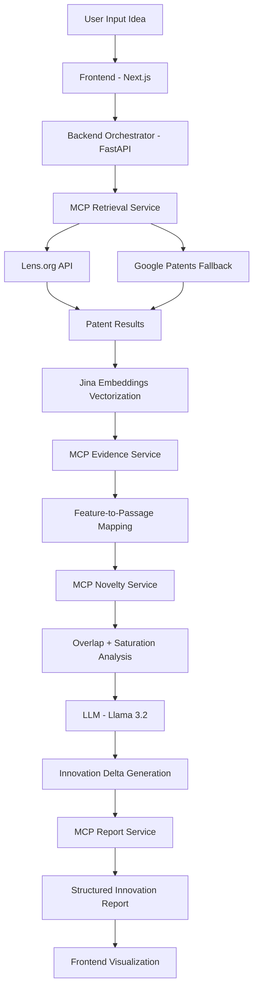

# 🚀 Intelligent Innovation Copilot

> **Hook:** Turn *“already patented”* ideas into **clear, actionable innovation pathways.**

---

## 🎥 Demo Videos

- 🎬 Demo : 

---

⚠️ Prototype Disclaimer

🚧 This is a prototype system

There are:

Known defects, Incomplete integrations & Areas needing optimization

However, this project is an excellent end-to-end learning system.

## 🧠 The Problem

Every founder, researcher, or innovator hits the same wall:

> *“I found a similar idea patented/productized already….. so what now?”*

Traditional patent tools tell you:
- What exists ❌  
- Who owns it ❌  

But they **don’t tell you how to move forward**.

---

### 🧩 The Founder’s Dilemma

You are stuck between:
- Reinventing something already patented ❌  
- Risking infringement ❌  
- Or abandoning your idea ❌  

---

## 💡 The Core Idea: Innovation Deltas

This project introduces:

> 🎯 **Innovation Delta = The specific technical gap that makes your idea patent-worthy**

Instead of stopping at search results, this system:
- Breaks your idea into features  
- Maps them to prior art  
- Identifies idea saturation vs novelty  
- Suggests **how to differentiate**

---

## ⚡ What Makes This Unique?

### 🧠 Agentic RAG + Difference Engineering

This is not just another RAG system.

It performs:
- Feature-level semantic decomposition (not just document retrieval)  
- Evidence-backed overlap detection across prior art  
- Multi-step **Agentic RAG via MCP (Microservice Command Protocol)** — orchestrating retrieval, evidence mapping, and novelty scoring as specialized agents  
- 🚀 **Difference Engineering**: converts overlap into actionable innovation pathways  

> It doesn’t just explain what exists — it tells you how to make your idea distinct and patent-worthy.

---

## 🏗️ Technical Architecture

### 📦 Tech Stack

| Layer | Technology |
|------|-----------|
| Frontend | Next.js |
| Runtime | Node.js |
| Backend | FastAPI |
| LLM | Llama 3.2 |
| Embeddings | Jina Embeddings |
| Database | PostgreSQL |
| Patent Data | Lens.org API |
| Orchestration | MCP (Microservice Command Protocol) |

---

### 🔄 Architecture Flow

## ⚙️ Setup & Execution

⚠️ Prerequisite

You must obtain Lens.org API access for live patent retrieval:

👉 https://www.lens.org/lens/user/subscriptions

▶️ Run the App
git clone <YOUR_REPO_URL>
cd innovation-copilot

run_all.bat (run the batch file in command prompt/powershell)

Access:
Open browser: http://127.0.0.1:5006/idea-input

🧪 How to Use

1️⃣ Submit Concept

Enter your idea in natural language

2️⃣ Semantic Analysis

System performs:
Patent retrieval, Feature extraction, Evidence mapping

3️⃣ Review Innovation Report

You get:
Feature decomposition, Prior art mapping, Novelty map, CPC codes

🚀 Innovation Deltas
📌 Example Scenario

🧾 Input

Idea title: AI Food Expiry Tracker
Domain: AI, computer-vision, smart-home
Problem statement: Households waste food because people forget what's in their fridge and when it expires. A phone camera scans fridge contents daily, identifies items using computer vision, estimates expiry dates, and sends timely alerts to use ingredients before they spoil.
Objectives: Reduce food waste, expiry alerts, recipe suggestions from near-expiry items
Constraints: Works with standard phone camera, no smart fridge required, offline inference
Tags: computer-vision, food-waste, edge-AI, smart-home

📊 Output

Existing Coverage & 
🚀 Innovation Delta Suggestions:
1. Emphasize ai food expiry tracker as the likely differentiator.
2. Describe implementation constraints for ai food expiry tracker more concretely.

🎯 Result: Not a search result, but a patentable direction

## Issues & Improvements

### 🐞 Known Issues:

Some UI sections may not populate if Lens API lacks metadata
📄 PDF export format is incorrect 
Occasional fallback to demo data if live retrieval fails

### 🔮 Future Improvements
1. Multi-Source Synthesis
Add Google Patents + ArXiv
Improve recall and coverage
2. Automated Claim Drafting
Generate initial patent claims
Based on Innovation Deltas
3. Interactive Patent Landscape
2D / 3D visualization
Identify white-space innovation zones

## 🧱 Build With Me

### 🚀 Let’s learn by building

This project is designed as a hands-on system to understand modern AI architecture.

🧠 What You’ll Learn
1. How Agentic RAG differs from standard RAG
2. How MCP enables modular AI pipelines
3. How embeddings power semantic retrieval
4. How prompting drives structured innovation
   
🔪 Core Concepts Explained
1. Agentic RAG

Instead of: Retrieve → Answer, 
We do: Retrieve → Compare → Analyze → Suggest

2. MCP (Microservice Command Protocol)

Each capability is a separate service: Service	Role, Retrieval, Patent search, Evidence, Mapping features, Novelty, Overlap detection, Report & Output generation

👉 Orchestrator = AI system coordinator

3. Feature Decomposition

Input idea → structured features:

[
  "Camera-based monitoring",
  "ERP integration",
  "Prediction model",
  "Temporal lag detection"
]
4. Innovation Delta Prompting

The LLM is guided to:

1. Identify saturation zones
2. Detect gaps
3. Suggest differentiation
🤝 Contributing

This is a learning + innovation project.

If you're interested in:

AI systems, Patent intelligence, Agentic workflows

